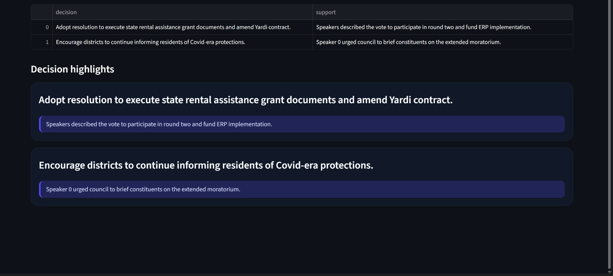
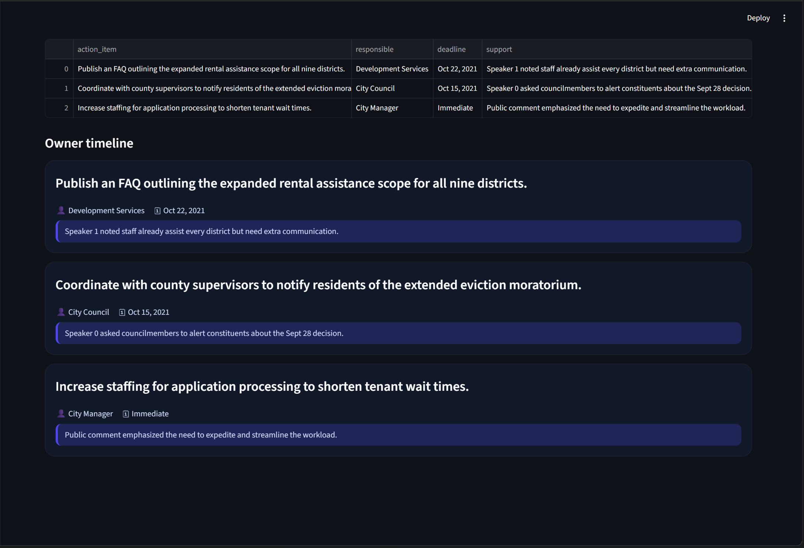
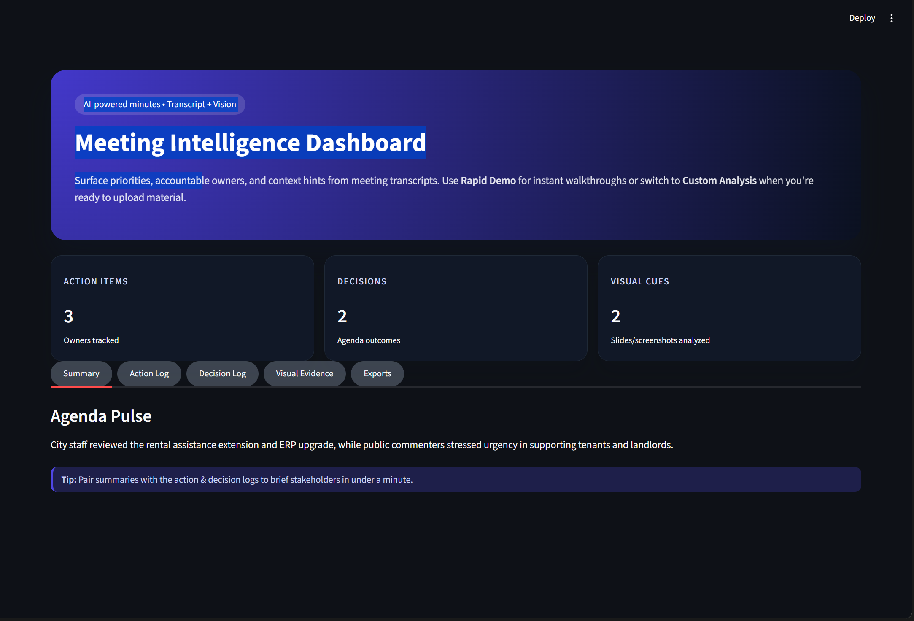

# Meeting Intelligence Dashboard

Streamlit-powered workflow that ingests meeting transcripts plus optional screenshots, extracts action items & decisions with open LLMs, captions visual cues with BLIP, and renders an interactive dashboard. Designed for instant demos (cached sample) or full custom analysis.

## ✨ Highlights

- **Dual-mode experience** – Rapid cached demo or full custom upload.
- **Transcript intelligence** – Chunked summarization, action log, decisions with supporting quotes.
- **Vision context** – BLIP captioning + topic tags for slides/whiteboards (runs only when images are provided).
- **Theme-aware UI** – CSS adjusts automatically for light/dark preferences.
- **Exports** – Download CSVs for actions/decisions plus Markdown summary.

## 🧠 Workflow

1. **Data ingest**
   - Custom upload (`.txt` / `.jsonl`) or MeetingBank snippet (first five utterances).
   - Optional screenshot upload (`.png`, `.jpg`, `.jpeg`, `.webp`).
2. **Analysis pipeline** (`src/analysis`)
   - `transcript.py`: chunking, summarization, action & decision extraction via FLAN-T5 small + DistilBART.
   - `vision.py`: BLIP captioner for visible action cues.
   - `pipeline.py`: orchestrates and returns a `MeetingReport` dataclass.
3. **Presentation** (`app.py`)
   - Hero + KPIs → tabs (Summary, Action Log, Decision Log, Visual Evidence, Exports).
   - Timeline cards show owners/deadlines/quotes; visual cards show thumbnail + tags.

## ⚙️ Setup & Usage

```bash
git clone https://github.com/prathameshfuke/Eonverse_Ai.git
cd Eonverse_Ai
python -m venv .venv
.\.venv\Scripts\activate          # PowerShell on Windows
pip install -r requirements.txt

# Run Streamlit
streamlit run app.py --server.port 8505
```

### Modes inside the app

| Mode | Description |
| --- | --- |
| **Rapid demo (cached)** | Loads `data/samples/meetingbank_housing_snippet_report.json` instantly – no models run. |
| **Custom analysis** | Upload transcript / use snippet + optional screenshots. LLMs and BLIP run on demand. |

## 📁 Key directories

```
├─ app.py                     # Streamlit UI
├─ requirements.txt           # Reproducible dependency list
├─ scripts/download_data.py   # Pulls MISeD, Public Meetings, MeetingBank, sample images
├─ data/
│  ├─ samples/
│  │  ├─ meetingbank_housing_snippet.jsonl
│  │  └─ meetingbank_housing_snippet_report.json
│  └─ sample_images/
├─ src/
   ├─ analysis/
   │  ├─ data_structures.py
   │  ├─ pipeline.py
   │  ├─ transcript.py
   │  └─ vision.py
   └─ utils/
      ├─ model_registry.py
      └─ text.py
```

## 📸 Screenshots

| Dark Mode | Action Items | Decision Log |
| --- | --- | --- |
|  |  |  |

## 🧪 Notes

- First-time model downloads (DistilBART, FLAN-T5, BLIP) may take a few minutes.
- Vision analysis is skipped during Rapid Demo to keep it instant.
- Cached demo can be refreshed by regenerating `meetingbank_housing_snippet_report.json` with `MeetingReport.to_dict()`.

## 📤 Deployment

Latest code lives in [`prathameshfuke/Eonverse_Ai`](https://github.com/prathameshfuke/Eonverse_Ai). Push workflow:

```bash
git add .
git commit -m "feat: <message>"
git push origin master
```

Happy analyzing! 🗂️
